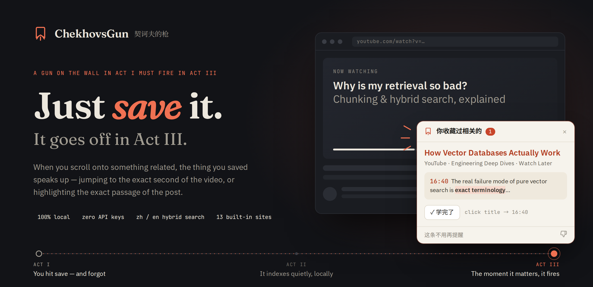
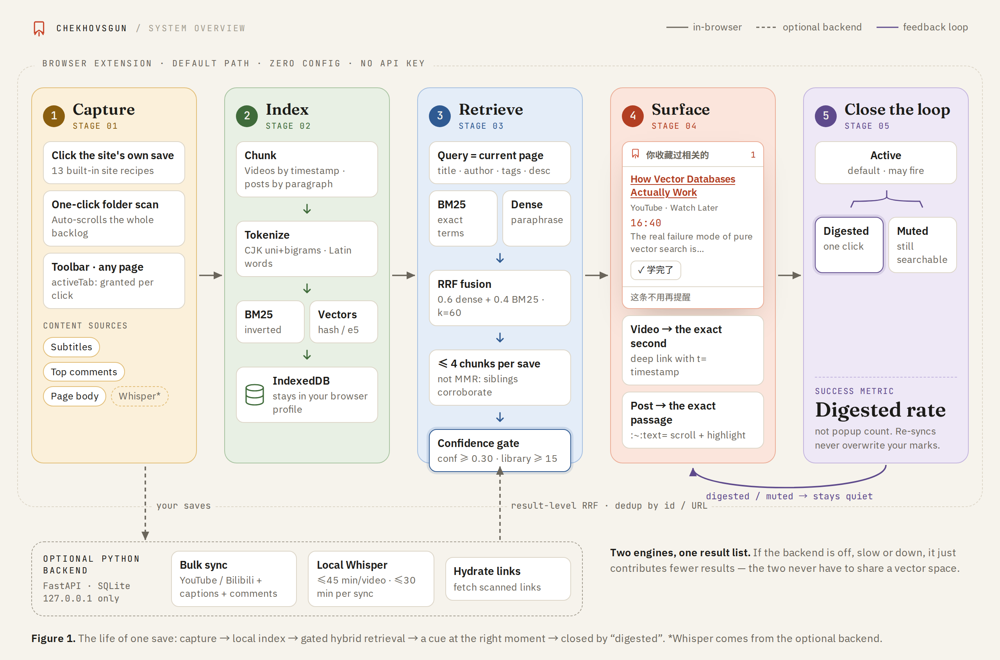
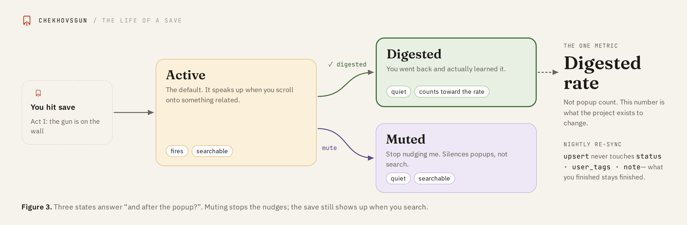
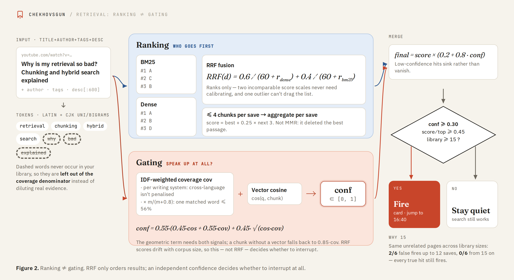
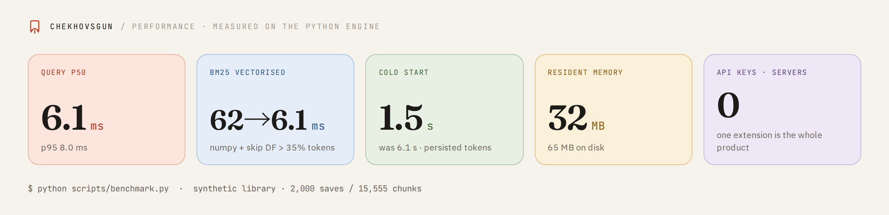

<div align="center">

# ChekhovsGun

**The things you saved come find you — right when you're scrolling past something related.**

[简体中文](README.md) · **English**



<p>


</p>

<h3>
<a href="https://github.com/JaspinXu/ChekhovsGun/releases/latest">Download</a> ·
<a href="#install-it-in-30-seconds">Install in 30 s</a> ·
<a href="#how-it-works">How it works</a> ·
<a href="#how-retrieval-works-and-why">Retrieval</a> ·
<a href="#known-limitations">Limitations</a>
</h3>

</div>

<br>

> If a gun hangs on the wall in the first act, it must go off in the third.
> Everything you bookmark deserves the same.

We've all done it: you stumble onto a genuinely great tutorial or a great answer, hit
save, tell yourself you'll read it later, and it stays in that folder forever.
ChekhovsGun inverts the problem. Instead of hoping you'll remember to dig through your
bookmarks, it waits until you're **actually looking** at something related and tells you
"you already saved this" — then reads you the relevant passage from what you saved.

The whole promise is: **just bookmark things.** You don't export anything, you don't
file anything, you don't come back to a reading list. You click the save button you were
already going to click, and the thing comes back to you when it is useful.

Videos and posts both, from platforms with an API and platforms without one. Everything
runs locally by default; optional backend integrations are described below.

> [!TIP]
> The extension is the whole product: no Python, no server, no API key, and capture,
> indexing and retrieval all happen inside the browser. The optional Python backend only
> adds local Whisper transcription, bulk sync through platform APIs, and body fetching
> for scanned links. Cards stay quiet until the library holds 15 saves,
> which is deliberate; searching on purpose works from the very first one.

<details>
<summary><b>Contents</b></summary>

- [Highlights](#highlights)
- [How it works](#how-it-works)
- [Install it in 30 seconds](#install-it-in-30-seconds)
- [Turn on semantic search](#turn-on-semantic-search)
- [The optional Python backend](#the-optional-python-backend)
- [Connect your video accounts](#connect-your-video-accounts)
- [Four content sources](#four-content-sources)
- [The life of a save](#the-life-of-a-save)
- [The popup waits until it can be trusted](#the-popup-waits-until-it-can-be-trusted)
- [How retrieval works (and why)](#how-retrieval-works-and-why)
- [That little "read"](#that-little-read)
- [Command line](#command-line)
- [Where the data lives](#where-the-data-lives)
- [Development](#development)
- [Packaging](#packaging)
- [Known limitations](#known-limitations)
- [License](#license)

</details>

---

## Highlights

<table>
<tr>
<td width="33%" valign="top"><b>Bookmarking is the only step</b><br>Click the site's own save button and that page is in. Nothing to export, nothing to file, no reading list to revisit.</td>
<td width="33%" valign="top"><b>It finds you while you scroll</b><br>The extension recognizes the page you're on and pops a card on a hit — a video seeks to the second that covers it, a post scrolls to and highlights the passage that does.</td>
<td width="33%" valign="top"><b>Take in the backlog at once</b><br>A one-click scan collects links loaded while scrolling a favourites page. Standalone mode initially stores titles and links.</td>
</tr>
<tr>
<td width="33%" valign="top"><b>Hybrid retrieval</b><br>A BM25 inverted index and vector recall run side by side, fused by rank with RRF, with a separate confidence score deciding whether this is worth interrupting you at all.</td>
<td width="33%" valign="top"><b>Mixed Chinese/English retrieval</b><br>CJK character unigrams + bigrams shared by both retrieval paths; optional multilingual-e5-small adds semantic vectors. Pure cross-language results can still be filtered by the confidence gate.</td>
<td width="33%" valign="top"><b>Four content sources</b><br>Subtitles (Bilibili CC and AI tracks, YouTube player tracks), top comments, local Whisper transcription as a fallback, and heuristic article extraction for posts.</td>
</tr>
<tr>
<td width="33%" valign="top"><b>The life of a save</b><br>Active, digested or muted. The digested rate — not the number of popups — is the success metric, and a re-sync never overwrites your own marks.</td>
<td width="33%" valign="top"><b>Local by default</b><br>Saves and retrieval stay on-device. Optional platform sync and remote AI providers use network requests; no telemetry.</td>
<td width="33%" valign="top"><b>Extensible site recipes</b><br>Zhihu, Xiaohongshu, WeChat articles, Weibo, Juejin, CSDN, Jianshu, Reddit, X, Stack Overflow, Medium, YouTube and Bilibili ship built in; a new site is one entry in <code>extension/recipes.js</code>.</td>
</tr>
</table>

---

## How it works

<picture>
  <source media="(prefers-color-scheme: dark)" srcset="docs/assets/v2/pipeline-en-dark.png">
  
</picture>

*The default path runs in the browser. Dashed paths are optional. Click to expand.*

1. **Take things in**, two ways that meet in the same place:
   - **The browser extension**, on its own, captures whatever you save on any site. It
     reads the page your already-logged-in browser can see, so there are no credentials
     to hand over. There is also a one-click scan that walks an existing favourites
     folder and takes in the backlog you already have.
   - **Adapters**, if you run the optional Python backend, pull saved videos from YouTube
     playlists / Liked / Watch Later and from Bilibili favourite folders, with subtitles
     (both Bilibili's human CC tracks and its AI-generated ones) and **top comments**.
     Videos with no subtitles fall back to local Whisper transcription.
2. **Index** — Cut the content into passages (timestamped for a video, paragraph-shaped
   for a post), embed them, and build a BM25 inverted index alongside. In the extension
   this lives in IndexedDB; in the backend, in SQLite.
3. **Retrieve** — Hybrid retrieval fused with RRF, plus a separate **confidence** score
   that decides whether this is worth interrupting you at all.
4. **Surface** — The extension recognizes the page you're on; on a hit it floats a card.
   Clicking through jumps to the exact second of a video, or scrolls to and highlights
   the exact paragraph of a post.
5. **Close the loop** — When you've read it, hit "学完了" and it stops bothering you.
   That number — not the number of popups — is this project's success metric.

The division of labour:

| Layer | Technology and responsibility |
| --- | --- |
| Extension | Chrome / Edge Manifest V3; per-site capture recipes, generic article extraction, cards and options page |
| Retrieval core | Dependency-free JavaScript (`extension/core/`); tokenization, chunking, BM25, vectors, RRF, confidence |
| Extension storage | IndexedDB — items, chunks and vectors all stay in the browser profile |
| Semantic model | Optional local multilingual-e5-small (int8), run in-browser by transformers.js |
| Optional backend | Python 3.10+, FastAPI, SQLite; bound to `127.0.0.1` only |
| What the backend adds | faster-whisper local transcription, YouTube Data API and Bilibili favourites sync |

---

## Install it in 30 seconds

Nothing to install but the extension itself. No Python, no server, no API keys.

1. Download the latest zip from [Releases](https://github.com/JaspinXu/ChekhovsGun/releases)
   and unzip it — or clone this repo and use its `extension/` directory
2. Open `chrome://extensions` in Chrome / Edge
3. Turn on "Developer mode" in the top right
4. Click "Load unpacked" and pick that directory

That is the whole setup. Capture, indexing and retrieval all run inside the browser,
against a local IndexedDB that never leaves your machine.

### Then just use the web normally

- **Click a site's own 收藏 / save / bookmark button** and the page comes in. Zhihu,
  Xiaohongshu, WeChat articles, Weibo, Juejin, CSDN, Jianshu, Reddit, X, Stack Overflow
  and Medium ship with recipes; YouTube and Bilibili work too.
- **On a favourites page**, a button appears: *把这个收藏夹收进 ChekhovsGun*. It scrolls the whole
  folder and collects every link — this is how you bring in the backlog you already have.
- **Anywhere else**, click the extension icon and press *收进 ChekhovsGun*. That uses `activeTab`,
  so the extension is granted access for that one click and holds no standing permission
  to read your browsing.

> [!IMPORTANT]
> The card stays quiet until your library holds 15 saves. That is deliberate, not a bug —
> see [The popup waits until it can be trusted](#the-popup-waits-until-it-can-be-trusted).
> The popup tells you how many more you need. Open the extension icon and use the search box to search from save one.

> [!NOTE]
> Some sites use one button for both saving and un-saving. Where the control exposes its
> state we read it; where it doesn't, a click is treated as a save.

Adding a site is one entry in `extension/recipes.js`. A site with no recipe still works
through the toolbar button: the generic reader picks out the element carrying the most
text that isn't inside links, which is the article on nearly any page.

---

## Turn on semantic search

Out of the box the extension retrieves with BM25 plus a hashed embedder — no download,
works offline, good at exact terms. What it cannot do is match *across languages*: a
Chinese question will not find the English talk that answers it.

A ~120MB on-device encoder adds semantic vectors, although the lexical confidence gate can still filter pure cross-language matches. It is not committed to the repo, so fetch it once:

```bash
npm ci
npm install --no-save @huggingface/transformers@3.7.2  # optional model runtime
npm run fetch-model  # vendors transformers.js + downloads multilingual-e5-small (int8)
```

Reload the extension and it picks the encoder up on its next start, then re-indexes your
library in the background. Nothing is unavailable while that runs — chunks that have not
been re-embedded yet still answer through BM25, they just rank on keywords for a while.

The model runs entirely on your machine. No query, no page and no saved text is ever sent
anywhere.

---

## The optional Python backend

The extension works independently. The optional Python backend adds:

- **Body hydration** for supported links captured by folder scans
- **Whisper transcription** for videos with no subtitle track
- **Bulk sync** of YouTube playlists / Liked / Watch Later and Bilibili favourite folders
  through their APIs, with subtitles and top comments

```bash
pip install -e .
chekhovsgun demo      # load sample saves and run one retrieval
chekhovsgun tray      # background daemon + tray icon, opens the dashboard
```

Then switch it on in the extension's options page, which is also where the loopback
permission is requested — a standalone install never asks for network access it does not
use.

When both are running, each retrieves independently and only the ranked lists are merged
(RRF, deduplicated on a canonicalised URL). The two never need to agree on a vector
space, and a backend that is stopped, slow or broken simply contributes nothing.

`demo` prints something like this:

```
pretending you just scrolled onto:
  Why is my retrieval so bad? Chunking and hybrid search explained

  ChekhovsGun says:
    You already saved 1 related item(s); the closest is “How Vector Databases
    Actually Work” by Engineering Deep Dives. From it: …the real failure mode of
    pure vector search is exact terminology. Hybrid search with BM25 fixes the
    cases where embeddings blur a precise term.

  1. How Vector Databases Actually Work
     Engineering Deep Dives · youtube · Watch Later · score 1.00
     https://www.youtube.com/watch?v=Xpzbywj7HbQ&t=1000s
     [16:40] The real failure mode of pure vector search is exact terminology…
```

---

## Connect your video accounts

<details open>
<summary><b>Bilibili</b></summary>

Bilibili has no public API, so it uses the cookie from your browser. On a logged-in
bilibili.com page press F12 → Application → Cookies and copy `SESSDATA`:

```bash
export CHEKHOVSGUN_BILIBILI_SESSDATA="your SESSDATA"
export CHEKHOVSGUN_BILIBILI_UID="your uid"        # optional, auto-detected if omitted

chekhovsgun ingest --source bilibili --limit 20   # try 20 first
chekhovsgun ingest --source bilibili              # full sync
```

By default it syncs **every** folder you created, plus Watch Later. To restrict it to a
few:

```bash
export CHEKHOVSGUN_BILIBILI_FOLDERS="deep-learning,backend"   # folder names or media_ids
```

> [!WARNING]
> Store SESSDATA in your environment variables or `config.toml` and refresh it when it expires.
> The backend sends it to Bilibili as a cookie for authenticated requests.

</details>

<details>
<summary><b>YouTube</b></summary>

Public and unlisted playlists need nothing but an API key (Google Cloud → enable the
YouTube Data API v3):

```bash
export CHEKHOVSGUN_YOUTUBE_API_KEY="AIza..."
export CHEKHOVSGUN_YOUTUBE_PLAYLISTS="PLxxxxxxxx,PLyyyyyyyy"

chekhovsgun ingest --source youtube
```

Liked (`LL`) and Watch Later (`WL`) are private to the account and need an OAuth access
token:

```bash
export CHEKHOVSGUN_YOUTUBE_OAUTH_TOKEN="ya29..."
chekhovsgun ingest --source youtube      # with no playlists set, grabs LL and WL
```

For better subtitle coverage, install the community transcript library:

```bash
pip install -e ".[youtube]"
```

</details>

<details>
<summary><b>Don't want to configure any of it?</b></summary>

Any json / jsonl / csv / plain list of links imports directly:

```bash
chekhovsgun import my-saves.json          # Google Takeout exports work
chekhovsgun import urls.txt               # one link per line
```

</details>

---

## Four content sources

**Subtitles** do the heavy lifting. Bilibili's CC and AI tracks are both collected, with
human ones preferred; YouTube goes through the player route.

**Comments** are a goldmine most comparable tools ignore. Top comments routinely contain
what the video itself doesn't: corrections, the prerequisite the author skipped, "this
actually changed after 7.0." They're plain text and arrive in a single request — the best
value-per-byte content in the project.

```bash
chekhovsgun ingest --no-comments    # if you'd rather not
```

**Local transcription** is the fallback. In a real bookmark folder roughly a third of the
videos have neither kind of subtitle; those used to enter the index on title and
description alone, which retrieves badly and can't deep-link. faster-whisper now fills
them in locally:

```bash
pip install -e ".[whisper]"     # faster-whisper + yt-dlp
chekhovsgun ingest --source bilibili
```

Audio never leaves the machine. Because transcription is a minutes-scale rather than
milliseconds-scale operation, it has two gates: skip any single video over 45 minutes, and
spend at most 30 minutes per sync on transcription (both configurable). It hangs off the
pipeline rather than living inside an adapter — it works given any URL, so a third source
gets it for free.

**Page text** is what makes posts work at all. The extension reads the article out of the
page it is already looking at; for links collected by a folder scan, the server fetches
them afterwards and runs the same extraction. That extractor is a heuristic rather than a
dependency, and it rests on one rule: *the element carrying the most text that is not
inside links is the article.* Navigation, sidebars, related-post rails and comment threads
all fail that test because they are mostly anchors. One detail that is easy to get wrong —
its length thresholds weight a CJK character as 2.5 latin ones, because a threshold tuned
on English prose rejects Chinese articles several paragraphs long.

```bash
chekhovsgun capture https://www.zhihu.com/question/…   # take a page in by hand
chekhovsgun hydrate                                    # fetch text for links already saved
```

---

## The life of a save

A save has three states, which exist to answer "what happens after it fires":

<picture>
  <source media="(prefers-color-scheme: dark)" srcset="docs/assets/v2/lifecycle-en-dark.png">
  
</picture>

| State | Meaning | Still pops? | Counts as done? |
| --- | --- | --- | --- |
| Active (还欠着) | Default | Yes | — |
| **Digested (已学完)** | You went back, read it, learned something | No | **Yes** |
| Muted (已静音) | Stop bringing this up | No | No |

```bash
chekhovsgun mark https://www.bilibili.com/video/BV1xx --digested --tag attention
chekhovsgun items --status active          # what you still owe yourself
chekhovsgun items --tag attention
```

The card has a "✓ digested" button right on it, and the dashboard filters by state and
tag.

Two design details: **muting stops interruptions but not retrieval** — it still shows up
when you search deliberately; and **re-syncing never overwrites your marks**. `upsert`
deliberately leaves the `status` / `user_tags` / `note` columns alone, otherwise a nightly
sync would resurrect everything you'd already digested.

---

## The popup waits until it can be trusted

Below **15 saves the card never fires**, and the dashboard says how many more you need.

This is not caution for its own sake. Confidence leans on IDF, and IDF means nothing over
a handful of documents: in a three-item library every word looks rare, so a page about
choosing a coffee grinder matches a saved post about choosing a database index on the
strength of the shared word 选择 — and scores 0.38, indistinguishable from a genuine
five-term match. Sweeping a fixed set of unrelated pages across growing library sizes put
the false fires at 2/6 up to twelve items and **0/6 from fifteen on**, with every true
match firing throughout.

So rather than bend scoring that is correct at normal sizes, the popup declines to fire
until it has enough to be right. Explicit search is never gated — silence is about not
interrupting you, exactly like muting.

```bash
export CHEKHOVSGUN_MIN_LIBRARY_ITEMS=0    # if you would rather judge for yourself
```

---

## How retrieval works (and why)

This is the part of the project that actually required thinking.

<picture>
  <source media="(prefers-color-scheme: dark)" srcset="docs/assets/v2/retrieval-en-dark.png">
  
</picture>

**Hybrid retrieval.** The default vector backend is a zero-dependency hashed n-gram
encoder — it works straight out of a clone, with no API key and no model download. The
price is that it has no real semantics and is easily fooled by text in the same register
on an unrelated topic. BM25's failure mode is exactly the opposite: dead accurate on
proper nouns (`KV cache`, `BV1xx4y1`), completely blind to paraphrase. Run both and fuse
with **RRF** — RRF looks only at ranks, not scores, so there's nothing to calibrate
between two scales that have nothing in common, and one outlier score can't drag the
result off course.

**Chinese tokenization.** Chinese has no spaces, so splitting on whitespace turns an
entire sentence into a single token. This uses CJK **character unigrams and bigrams** combined with
Latin words, and the vector path and the BM25 path share the same tokenizer so both recall
routes see identical text.

**Confidence and ranking are two different things.** An RRF score can order results but
can't answer "should this pop up at all" — its range drifts with corpus size. So
confidence is computed separately on a 0–1 scale: a blend of vector cosine and IDF-weighted coverage of
the query terms (a linear part plus a √(cos·cov) geometric term, so both signals must fire); below 0.30 the result is judged irrelevant. A few details
matter:

- **Terms absent from the corpus don't count in the denominator.** "How I made my React
  app 10x faster" should be judged on `react` alone, not diluted by four words that could
  never appear in your saves.
- **Coverage is computed per writing system.** Chinese query terms can never appear in
  English subtitles; counting them in the denominator would make every cross-language hit
  look irrelevant — and cross-language is exactly this project's most valuable case.
- **A single matching term is not evidence.** "How do I braise pork" and a Redis explainer
  both contain "how do I." Coverage decays with saturation over the number of matched
  terms, so one term earns at most about 56% of the score.

**At most 4 passages per save.** A 40-minute lecture cuts into dozens of near-identical
chunks. The textbook answer is MMR, and it's wrong here: results are aggregated **by
save** in the end, and multiple passages from one save are corroborating evidence — MMR
deletes them, and in testing what it deleted was precisely the best-matching passage. A
per-save cap works far better.

Want better quality? Swap in a real multilingual encoder — one line of config:

```bash
pip install -e ".[neural]"
export CHEKHOVSGUN_EMBEDDING_BACKEND=sentence-transformers
chekhovsgun reindex
```

Or any OpenAI-compatible embedding endpoint (DashScope / SiliconFlow / Ollama / vLLM):

```bash
export CHEKHOVSGUN_EMBEDDING_BACKEND=openai
export CHEKHOVSGUN_EMBEDDING_BASE_URL=https://dashscope.aliyuncs.com/compatible-mode/v1
export CHEKHOVSGUN_EMBEDDING_API_KEY=sk-...
export CHEKHOVSGUN_EMBEDDING_MODEL=text-embedding-v3
chekhovsgun reindex
```

### Performance

On a synthetic library of 2,000 saves / 15,555 passages (`python scripts/benchmark.py`):

<picture>
  <source media="(prefers-color-scheme: dark)" srcset="docs/assets/v2/stats-en-dark.png">
  
</picture>

| Metric | Value |
| --- | --- |
| Index build | 10.3 s (~1500 passages/s, tokenization and embedding included) |
| Cold start (rebuild in-memory index) | 1.5 s |
| Retrieval p50 / p95 | **6.1 ms / 8.0 ms** |
| Full relate (including the read) | 7.3 ms |
| Disk | 65 MB |
| Resident memory (vector matrix) | 32 MB |

The things that made it fast, all measured rather than guessed:

- **BM25 runs on numpy.** Chinese tokenization produces character unigrams, and common
  characters have posting lists tens of thousands of entries long; walking one query in a
  Python loop took 56 ms — 90% of total query time. Numpy arrays plus fancy-indexed
  accumulation brought it down to 6 ms.
- **Skip high-frequency terms.** Tokens appearing in more than 35% of passages are
  dropped outright: their IDF is near zero so they can't change the ranking, yet they
  carry the longest posting lists.
- **Tokenization is persisted.** Tokenizing 15k passages takes 6 seconds, and it used to
  happen on every in-memory index rebuild; now it's computed at write time and stored in
  SQLite, cutting cold start to 1.5 s.
- **The cache key is a write counter.** Six COUNT queries used to run per request; the
  store's monotonic write counter costs nothing.

---

## That little "read"

On a hit, the card carries a sentence explaining how the save relates to what you're
watching and what you'd gain from going back. With an LLM configured it's generated;
without one it quotes the subtitle text directly — **quoting can never fabricate**, so the
default path is safe and the popup never hangs on a loading spinner.

```bash
export CHEKHOVSGUN_LLM_API_KEY=sk-...
export CHEKHOVSGUN_LLM_MODEL=gpt-4o-mini
export CHEKHOVSGUN_LLM_BASE_URL=            # any OpenAI-compatible endpoint
```

---

## Command line

| Command | What it does |
| --- | --- |
| `chekhovsgun demo` | Load sample data and run one retrieval |
| `chekhovsgun status` | Inventory, digestion rate, which sources are configured |
| `chekhovsgun ingest [--source X] [--limit N] [--force]` | Sync bookmarks |
| `chekhovsgun ingest --whisper` / `--no-comments` | Force local transcription / skip comments |
| `chekhovsgun import <file>` | Import from json/jsonl/csv/txt |
| `chekhovsgun capture <url> [--file urls.txt]` | Take a page in by URL — what the extension does |
| `chekhovsgun hydrate` | Fetch the article text of saves stored as bare links |
| `chekhovsgun search "query"` | Search your own saves |
| `chekhovsgun relate <url>` | Simulate: what would pop up on this video |
| `chekhovsgun mark <url> --digested` | Mark digested / muted / tagged |
| `chekhovsgun items --status active` | List what you still owe yourself |
| `chekhovsgun tray` | Background daemon with a tray icon |
| `chekhovsgun serve [--open]` | Foreground server + dashboard |
| `chekhovsgun reindex` | Rebuild vectors after changing the embedding backend |

---

## Where the data lives

<details>
<summary>Show</summary>

| What | Where |
| --- | --- |
| Extension library | IndexedDB (`chekhovsgun`) in your browser profile — items, chunks, vectors |
| Extension settings | `chrome.storage.sync` |
| On-device encoder | `extension/models/`, fetched by `npm run fetch-model`, never committed |
| Backend index (optional) | `$CHEKHOVSGUN_HOME/index.db` (defaults to `~/.chekhovsgun/`, `%LOCALAPPDATA%` on Windows) |
| Backend config | `config.toml` in the same directory, or environment variables (see `.env.example`) |
| Credentials | Only in your environment variables / config file; always masked in API responses |

Capture and retrieval run locally by default. The optional backend listens on
`127.0.0.1`; platform sync contacts the relevant platforms. If you configure remote
embedding or LLM providers, their requests send text to those providers. Extension
preferences use browser sync storage; saved content stays in local IndexedDB. No telemetry.

</details>

---

## Development

<details>
<summary>Show</summary>

```bash
npm install && npm test     # the extension engine, no browser needed
pip install -e ".[dev]"
pytest                      # the backend
pytest tests/test_relevance.py -v   # golden-set regression for retrieval quality
```

The JavaScript engine in `extension/core/` is a port of the Python one, and the port is
held to it by fixtures captured from the real Python functions — tokenizer output, chunk
boundaries, chunk ids, URL identity and the coverage/confidence arithmetic all have to
match exactly. Regenerate them with `python scripts/gen_fixtures.py` if you change either
side. Ranking itself is compared behaviourally rather than numerically, because the two
engines deliberately use different hash functions and so different vector spaces.

`extension/core/` imports nothing from the browser — no `chrome.*`, no DOM, no `fetch` —
and a test enforces that. Storage sits behind one file (`extension/platform/idb.js`), so
the planned Android app can take the engine unchanged and supply SQLite instead.

`tests/test_relevance.py` is the file worth reading: it pins down concrete examples of
what *should* fire and what *shouldn't*, cross-language cases included. Any retrieval
change that breaks one of them goes red.

Adding a third source (Xiaohongshu, Zhihu, Pocket…) means implementing three methods from
`chekhovsgun/adapters/base.py`: list saves, fetch content, recognize a URL. The rest of
the code doesn't know where a chunk came from.

</details>

---

## Packaging

<details>
<summary>Show</summary>

```bash
npm run build                       # → dist/chekhovsgun-<version>-{lite,with-model}.zip
```

The zip is "with-model" if `npm run fetch-model` has been run and "lite" otherwise; the
build prints which one it made, because the difference is ~120MB and a real difference in
retrieval quality.

For the optional backend:

```bash
pip install -e ".[tray]" pyinstaller
pyinstaller chekhovsgun.spec        # → dist/ChekhovsGun(.exe)
```

Double-clicking the resulting single file gives you tray mode; run it with arguments and
it's still the full CLI (`ChekhovsGun.exe ingest --source bilibili`), so one binary does
both. Pushing a tag has CI build artifacts for all three platforms plus the extension zip.

</details>

---

## Known limitations

- Standalone video capture stores titles and descriptions; subtitles, top comments and Whisper transcripts come from optional backend sync.
- Folder scanning may miss paginated or virtualized entries. Standalone mode does not fetch article bodies in the background.
- Even with the semantic model, the lexical confidence gate can suppress pure cross-language or paraphrase matches.

- Until you run `npm run fetch-model`, the extension retrieves with BM25 plus a hashed
  encoder, which has no real semantics — cross-language and paraphrase matching need the
  on-device model.
- Bilibili SESSDATA expires in about a month; YouTube OAuth tokens expire in an hour, so
  long-running syncs need your own refresh.
- The Whisper fallback needs ffmpeg on the machine and is CPU-bound; the first run
  downloads a model.
- YouTube comments go through the Data API, and videos with comments disabled return 403 —
  that's expected, and they're skipped.
- The extension works on YouTube Shorts, but the vertical feed switches fast and the
  default 1.4 s debounce may still be too sensitive.
- **Feeds are deliberately excluded.** The card only appears on an item's own page. On a
  Zhihu or Xiaohongshu home feed a dozen posts share the viewport, and guessing which one
  you are reading turns the card into harassment.
- Site recipes are selectors, and selectors rot. When one breaks, that site falls back to
  the generic reader rather than failing — but a specific recipe will always beat it, so
  `extension/recipes.js` is the file to fix.
- Captured pages are whatever your browser could see. A page behind a paywall or rendered
  entirely by JavaScript after load may come in with its title and nothing else.
- The desktop browser isn't where most people scroll — phones are, and that's a different
  engineering problem. `POST /api/relate` takes any URL plus text and answers, which is
  the seam a phone client would plug into; nothing on the phone side exists yet.

---

## License

MIT
