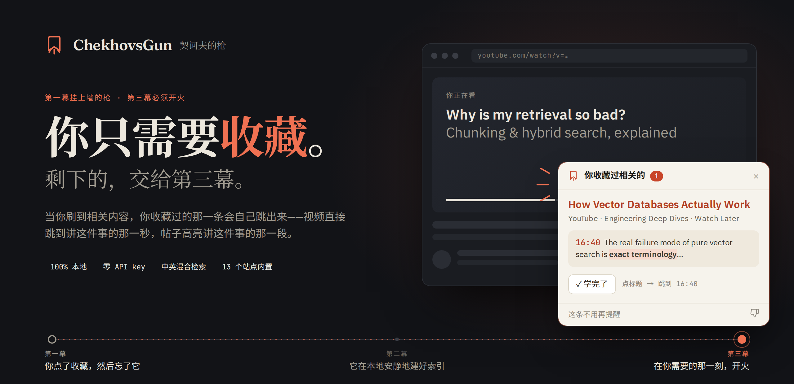
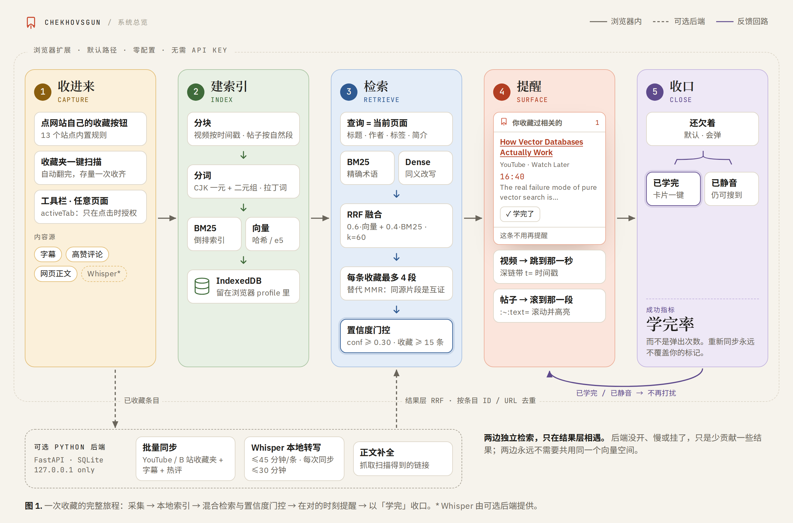
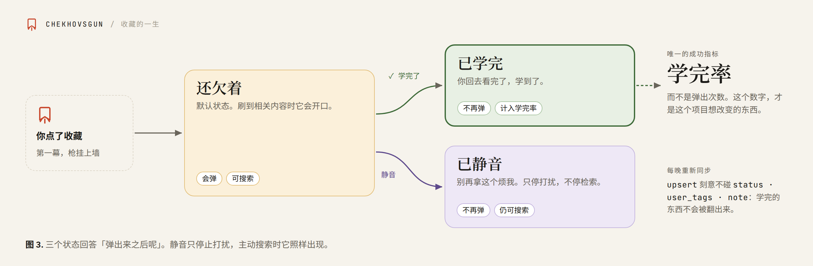
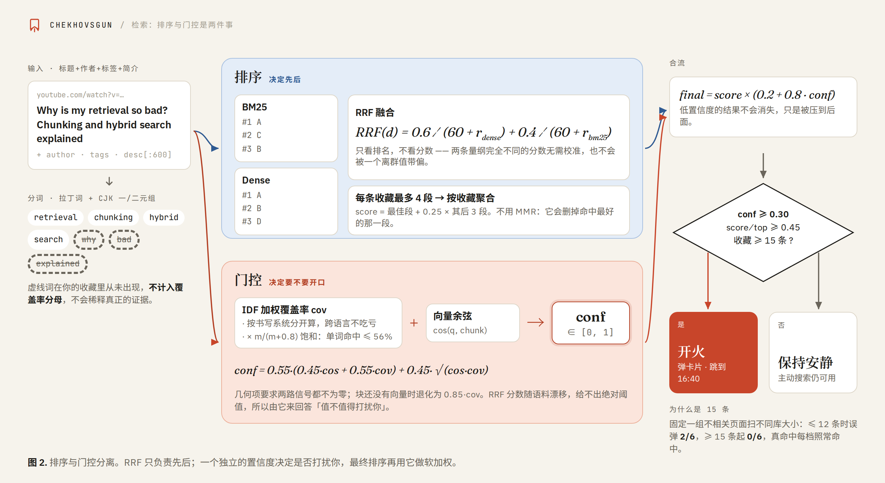
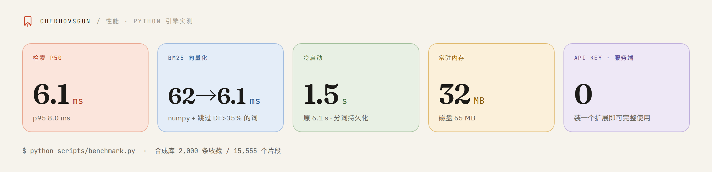

# ChekhovsGun

**简体中文** · [English](README.en.md)

<p align="center"></p>

[下载扩展](https://github.com/JaspinXu/ChekhovsGun/releases/latest) · [安装指南](#30-秒装好) · [架构图](#它是怎么工作的)

> 如果第一幕墙上挂着一把枪，第三幕它就必须开火。
> 你收藏的每一条内容，也应该如此。

**你收藏过的东西，会在你刷到相关内容时自己跳出来找你。**

我们都干过同一件事：刷到一个讲得特别好的教程、一条写得特别透的回答，点了收藏，
想着"以后一定看"，然后它就永远躺在收藏夹里吃灰了。ChekhovsGun 把这件事反过来做——
不需要你想起来去翻收藏夹，而是在你**正在看**相关内容的那一刻，告诉你「这个你收藏过」，
并把当时那条里相关的段落直接讲给你听。

整个产品的承诺只有一句：**你只需要收藏。** 不用导出，不用整理，不用回头翻清单。
你照常点那个本来就要点的收藏按钮，剩下的事情由它在该出现的时候还给你。

视频和帖子都收，有 API 的平台和没 API 的平台都收。全部在本地运行，
收藏夹和浏览记录不会离开这台机器。


> 装一个扩展就能完整使用：不需要 Python，不需要服务端，不需要任何 API key，
> 采集、建索引、检索全部在浏览器里完成。可选的 Python 后端补充本地 Whisper 转写、
> 平台 API 批量同步和扫描链接的正文抓取。藏书满 15 条之后卡片才会开始弹，
> 这是故意的；主动搜索从第一条收藏起就能用：点击扩展图标，在「搜索你的收藏」里输入关键词。

[30 秒装好](#30-秒装好) · [功能亮点](#功能亮点) · [它是怎么工作的](#它是怎么工作的) · [打开语义检索](#打开语义检索) · [可选的 Python 后端](#可选的-python-后端) · [命令行](#命令行) · [已知限制](#已知限制)

---

## 功能亮点

- **只需要收藏：** 点网站自己的收藏按钮，这一页就进来了。不用导出，不用整理，不用回头翻清单。
- **刷到就提醒：** 扩展识别你当前在看的页面，命中就弹一张卡片——视频跳到讲这件事的那一秒，帖子滚动到并高亮出讲这件事的那一段。
- **存量一次收完：** 收藏夹页面上的一键扫描会自动往下翻完整个收藏夹，收集当前列表滚动加载出的链接；独立模式先存标题和链接。
- **混合检索：** BM25 倒排与向量召回并行，RRF 按排名融合，再由一个独立的置信度决定「到底要不要打扰你」。
- **中英混合检索：** CJK 字符一元组 + 二元组分词，向量与 BM25 共用同一套；可选的本地 multilingual-e5-small 提供语义向量，纯跨语言召回仍受置信度门槛限制。
- **四个内容源：** 字幕（B 站 CC 与 AI 字幕、YouTube 播放器轨）、高赞评论、本地 Whisper 转写兜底，以及网页正文的启发式抽取。
- **收藏的一生：** 还欠着 / 已学完 / 已静音三个状态。学完率而不是弹出次数才是成功指标，重新同步永远不会覆盖你的标记。
- **默认本地：** 收藏与检索在设备上完成；可选的平台同步和远程 AI 服务会发起网络请求。没有遥测。
- **站点规则可扩展：** 知乎、小红书、公众号、微博、掘金、CSDN、简书、Reddit、X、Stack Overflow、Medium、YouTube、B 站已内置；加一个新站点只要在 `extension/recipes.js` 里加一条记录。

---

## 它是怎么工作的

<picture>
  <source media="(prefers-color-scheme: dark)" srcset="docs/assets/v2/pipeline-zh-dark.png">
  
</picture>

*默认路径在浏览器内完成；虚线为可选后端。点击图片可查看大图。*

1. **收进来**，两条路最后汇到同一个地方：
   - **浏览器扩展**自己就能干完全部的活。它读的是你**已经登录的浏览器**看得到的页面，
     所以不需要你交出任何凭据。另外还有一键扫描，把你收藏夹里积压的存量整个收进来。
   - **适配器**（如果你跑了可选的 Python 后端）从 YouTube 播放列表 / Liked /
     Watch Later 和 B 站收藏夹拉取你保存过的视频，连同字幕（B 站 CC 字幕与 AI 字幕
     都要）和**高赞评论**。完全没有字幕的，用本地 Whisper 转写兜底。
2. **索引** — 把内容切成段落（视频带时间戳，帖子按自然段），算向量，同时建 BM25 倒排。
   在扩展里这些存在 IndexedDB，在后端则是 SQLite。
3. **检索** — 混合检索 + RRF 融合，再用一个独立的**置信度**决定「到底要不要打扰你」。
4. **提醒** — 扩展识别你当前在看的页面，命中就弹一张卡片。点进去：视频跳到讲这件事的
   那一秒，帖子滚动到并高亮出讲这件事的那一段。
5. **收口** — 看完了点一下「学完了」，它就不会再来烦你。
   这个数字（而不是弹出次数）才是这个项目的成功指标。

分工大致是这样：

| 层级 | 技术与职责 |
| --- | --- |
| 扩展 | Chrome / Edge Manifest V3；站点规则采集、通用正文抽取、卡片与选项页 |
| 检索核心 | 零依赖 JavaScript（`extension/core/`）；分词、分块、BM25、向量、RRF、置信度 |
| 扩展存储 | IndexedDB，条目与分块与向量都留在浏览器 profile 里 |
| 语义模型 | 可选的本地 multilingual-e5-small（int8），由 transformers.js 在浏览器内运行 |
| 可选后端 | Python 3.10+、FastAPI、SQLite；只监听 `127.0.0.1` |
| 后端补的能力 | faster-whisper 本地转写，YouTube Data API 与 B 站收藏夹批量同步 |

---

## 30 秒装好

除了扩展本身，什么都不用装。不需要 Python，不需要服务端，不需要任何 API key。

1. 从 [Releases](https://github.com/JaspinXu/ChekhovsGun/releases) 下载最新的 zip 解压，
   或者直接 clone 本仓库用它的 `extension/` 目录
2. Chrome / Edge 打开 `chrome://extensions`
3. 打开右上角「开发者模式」
4. 点「加载已解压的扩展程序」，选择那个目录

到这里就装完了。采集、建索引、检索全部在浏览器里完成，数据存在本地 IndexedDB，
不会离开你的机器。

### 之后你照常上网就行

- **点网站自己的「收藏」按钮**，这一页就进来了。知乎、小红书、公众号、微博、掘金、
  CSDN、简书、Reddit、X、Stack Overflow、Medium 都内置了规则，YouTube 和 B 站也一样。
- **在收藏夹页面**上会出现一个按钮：*把这个收藏夹收进 ChekhovsGun*。它会自动往下翻完整个收藏夹，
  把每一条链接都收进来——**你积压的存量就是这样一次性收进来的**。
- **其它任何页面**，点扩展图标再点*收进 ChekhovsGun*。这条路走的是 `activeTab`：
  只在你点的那一下授权，扩展平时没有读取你浏览记录的权限。

**收藏不满 15 条之前卡片不会弹**。这是故意的，不是坏了——原因见
[收藏太少时它不会弹](#收藏太少时它不会弹)。弹窗里会告诉你还差几条，
而主动搜索从第一条收藏起就能用：点击扩展图标，在「搜索你的收藏」里输入关键词。

> 有些网站收藏和取消收藏是同一个按钮。控件自己暴露了状态的，我们按状态判断；
> 判断不出来的，按「收藏」处理。

加一个新站点只要在 `extension/recipes.js` 里加一条记录。完全没有规则的站点也能用
（走工具栏按钮）：通用抽取器会挑出**正文密度最高、且不在链接里**的那个元素，
这在绝大多数页面上就是正文。

---

## 打开语义检索

开箱状态下，扩展用的是 BM25 加一个哈希向量：不用下载、完全离线、对精确术语很准。
它做不到的是**跨语言**——中文问题找不到回答它的那个英文视频。

一个约 120MB 的本地模型可以提供语义向量，但纯跨语言命中仍可能被词面覆盖率门槛过滤。它没有提交进仓库，需要拉一次：

```bash
npm ci
npm install --no-save @huggingface/transformers@3.7.2  # 可选模型运行库
npm run fetch-model  # 内置 transformers.js + 下载 multilingual-e5-small（int8 量化）
```

然后重新加载扩展，它会在下次启动时接上这个模型，并在后台重建索引。
重建期间没有任何东西会「消失」——还没重新编码的分块照样能被 BM25 检索到，
只是这段时间里按关键词排序。

模型完全跑在你自己的机器上。查询、页面、收藏的正文，都不会发到任何地方。

---

## 可选的 Python 后端

扩展可以独立使用。Python 后端提供这些额外能力：

- **链接正文补全**，尝试抓取收藏夹扫描得到的链接；登录墙或动态页面可能抓不到
- **Whisper 本地转写**，给没有字幕轨的视频用
- **批量同步** YouTube 播放列表 / Liked / 稍后再看，以及 B 站收藏夹，
  通过它们的 API 连字幕和热评一起拿

```bash
pip install -e .
chekhovsgun demo      # 灌一批示例收藏，并演示一次检索
chekhovsgun tray      # 后台常驻 + 托盘图标，自动打开仪表盘
```

然后在扩展的选项页里打开它——本机地址的访问权限也是在那里申请的，
独立安装的扩展不会去要它根本用不到的网络权限。

两边都在跑的时候，各自独立完成检索，只在结果层用 RRF 融合、按归一化 URL 去重。
两边永远不需要共用同一个向量空间；后端没开、很慢或者挂了，就只是少贡献一些结果而已。

`demo` 会输出类似这样的东西：

```
pretending you just scrolled onto:
  Why is my retrieval so bad? Chunking and hybrid search explained

  ChekhovsGun says:
    You already saved 1 related item(s); the closest is “How Vector Databases
    Actually Work” by Engineering Deep Dives. From it: …the real failure mode of
    pure vector search is exact terminology. Hybrid search with BM25 fixes the
    cases where embeddings blur a precise term.

  1. How Vector Databases Actually Work
     Engineering Deep Dives · youtube · Watch Later · score 1.00
     https://www.youtube.com/watch?v=Xpzbywj7HbQ&t=1000s
     [16:40] The real failure mode of pure vector search is exact terminology…
```

---

## 接上你的视频账号

### 哔哩哔哩

B 站没有公开 API，所以用你浏览器里的 cookie。在已登录的 bilibili.com 页面按
F12 → Application → Cookies，复制 `SESSDATA`：

```bash
export CHEKHOVSGUN_BILIBILI_SESSDATA="你的 SESSDATA"
export CHEKHOVSGUN_BILIBILI_UID="你的 uid"        # 可选，不填会自动探测

chekhovsgun ingest --source bilibili --limit 20   # 先拿 20 条试试
chekhovsgun ingest --source bilibili              # 全量同步
```

默认会同步**所有**自建收藏夹 + 稍后再看。只要某几个收藏夹的话：

```bash
export CHEKHOVSGUN_BILIBILI_FOLDERS="深度学习,后端"   # 收藏夹名或 media_id
```

> SESSDATA 保存在你自己的环境变量或 `config.toml` 中，失效后需要更新。
> 后端会将它作为 Cookie 发给 Bilibili，用于需要登录的请求。

### YouTube

公开/不公开播放列表用 API key 就够了（Google Cloud → 启用 YouTube Data API v3）：

```bash
export CHEKHOVSGUN_YOUTUBE_API_KEY="AIza..."
export CHEKHOVSGUN_YOUTUBE_PLAYLISTS="PLxxxxxxxx,PLyyyyyyyy"

chekhovsgun ingest --source youtube
```

Liked（`LL`）和 Watch Later（`WL`）是账号私有的，需要 OAuth access token：

```bash
export CHEKHOVSGUN_YOUTUBE_OAUTH_TOKEN="ya29..."
chekhovsgun ingest --source youtube      # 不指定播放列表时自动抓 LL 和 WL
```

字幕推荐装上官方社区的库，覆盖率更高：

```bash
pip install -e ".[youtube]"
```

### 都不想配？

任何 json / jsonl / csv / 纯链接列表都能直接导入：

```bash
chekhovsgun import my-saves.json          # 支持 Google Takeout 导出
chekhovsgun import urls.txt               # 一行一个链接
```

---

## 四个内容源

**字幕**是主力。B 站的 CC 字幕和 AI 字幕都收，人工优先；YouTube 走播放器那条路。

**评论**是被大多数同类工具忽略的一座金矿。高赞评论里常有视频本身没有的东西：
勘误、UP 跳过的前置知识、"其实 7.0 之后已经不是这样了"。而且它是纯文本，
一个请求就能拿到，是这个项目里性价比最高的内容。

```bash
chekhovsgun ingest --no-comments    # 不想要的话
```

**本地语音转写**是兜底。真实收藏夹里大约三分之一的视频两种字幕都没有，
这些以前只能靠标题和简介入库，既检索不准也没法跳转。现在用 faster-whisper
在本地补上：

```bash
pip install -e ".[whisper]"     # faster-whisper + yt-dlp
chekhovsgun ingest --source bilibili
```

音频不出本机。因为转写是分钟级而不是毫秒级的，它有两道闸：单个视频超过 45 分钟
就跳过，每次同步最多花 30 分钟在转写上（都可配置）。它挂在管线上而不是某个
adapter 里——只要有 URL 就能用，所以以后加第三个来源时是白送的。

**网页正文**是帖子能用起来的前提。扩展直接从它已经打开的页面里读正文；
收藏夹扫描收进来的链接，由服务端事后抓取、走同一套抽取。这个抽取器是启发式的，
不是一个依赖，它只靠一条规则：**正文是「不在链接里的文字最多」的那个元素**。
导航栏、侧边栏、相关推荐、评论区全都过不了这一关，因为它们基本上全是 `<a>`。
一个很容易做错的细节：它的长度阈值把一个 CJK 字符按 2.5 个拉丁字符算——
按英文散文调出来的阈值，会把好几段长的中文文章判成「没找到正文」。

```bash
chekhovsgun capture https://www.zhihu.com/question/…   # 手动收一页进来
chekhovsgun hydrate                                    # 给只有链接的收藏补正文
```

---

## 收藏的一生

一件收藏有三个状态，用来回答「弹出来之后呢」：

<picture>
  <source media="(prefers-color-scheme: dark)" srcset="docs/assets/v2/lifecycle-zh-dark.png">
  
</picture>

| 状态 | 含义 | 还会弹吗 | 算进学完率吗 |
| --- | --- | --- | --- |
| 还欠着 | 默认 | 会 | — |
| **已学完** | 你回去看完了，学到了 | 不会 | **算** |
| 已静音 | 别再拿这个烦我 | 不会 | 不算 |

```bash
chekhovsgun mark https://www.bilibili.com/video/BV1xx --digested --tag 注意力
chekhovsgun items --status active          # 还欠着的
chekhovsgun items --tag 注意力
```

卡片上直接有「✓ 学完了」按钮，仪表盘里也能按状态、类型和标签筛。
（命令行里的标志仍然叫 `--digested`，状态值仍然是 `digested`——
那是 API 和脚本会用到的标识符，为了改个措辞去动它不值得。）

两个设计细节：**静音只停止打扰，不影响检索**——你主动搜的时候它照样出来；
**重新同步永远不会覆盖你的标记**，`upsert` 刻意不碰 `status` / `user_tags` / `note`
这三列，否则每晚一次同步就会把你学完的东西又翻出来。

---

## 收藏太少时它不会弹

**藏书不到 15 条，卡片一次都不会弹**，仪表盘上会写着还差几条。

这不是无谓的保守。置信度依赖 IDF，而 IDF 在只有几篇文档时毫无意义：
三条收藏的库里每个词看起来都很罕见，于是「磨豆机怎么选择」会因为共享一个「选择」，
匹配上一条讲数据库索引选择的收藏——**得分 0.38，和一次真正命中五个词的匹配无法区分**。
拿一组固定的不相关页面在不同库大小上扫了一遍：十二条以内误弹 2/6，
**从十五条起误弹 0/6**，而真正该命中的每一档都照常命中。

所以与其去扭曲那套在正常库大小下本来就正确的打分，不如让弹窗等到自己足够可信再开口。
主动搜索永远不受这条限制——安静是为了不打扰你，跟静音是同一个道理。

```bash
export CHEKHOVSGUN_MIN_LIBRARY_ITEMS=0    # 你要是想自己判断
```

---

## 检索是怎么做的（以及为什么这么做）

这部分是整个项目里真正需要动脑子的地方。

<picture>
  <source media="(prefers-color-scheme: dark)" srcset="docs/assets/v2/retrieval-zh-dark.png">
  
</picture>

**混合检索。** 默认的向量后端是一个零依赖的哈希 n-gram 编码器——克隆下来就能用，
不需要 API key，不需要下模型。代价是它没有真正的语义，
容易被「语域相同但主题无关」的文本骗到。BM25 的失败模式正好相反：
它对专有名词（`KV cache`、`BV1xx4y1`）极准，但完全不懂同义改写。
两个一起用，再用 **RRF** 融合——RRF 只看排名不看分数，
所以不需要校准两条完全不同量纲的分数，也不会被一个离群分数带偏。

**中文分词。** 中文没有空格，直接按空白切会把一整句话变成一个 token。
这里用的是 CJK **字符一元组与二元组** + 拉丁词的组合，向量和 BM25 共用同一套分词，
保证两条召回路径看到的是同一份文本。

**置信度与排序是两件事。** RRF 分数只能排序，不能回答「这到底要不要弹出来」——
它的取值范围随语料规模漂移。所以另算了一个 0~1 的**置信度**：
由向量余弦和查询词的 IDF 加权覆盖率混合而成（线性项加一个 √(cos·cov) 几何项，两路信号缺一就上不去），低于 0.30 就判定为无关。
几个关键细节：

- **语料里没出现过的词不计入分母。** "How I made my React app 10x faster"
  只应该按 `react` 来判断，而不是被四个收藏里根本不可能出现的词稀释掉。
- **按书写系统分开算覆盖率。** 中文查询词永远不可能出现在英文字幕里，
  把它算进分母会让所有跨语言命中看起来都不相关——
  而跨语言恰恰是这个项目最有价值的场景。
- **单个词的匹配不算证据。**「红烧肉的做法」和一个 Redis 讲解都含有「做法」。
  覆盖率按命中词数做饱和衰减，一个词最多只能拿到约 56% 的分。

**每个收藏最多贡献 4 个片段。** 一个 40 分钟的讲座会切出几十个几乎一样的块。
教科书答案是 MMR，但在这里是错的：结果最终要按**收藏**聚合，
同一个收藏的多个片段是互相印证的证据，而 MMR 会把它们删掉——
实测中它删掉的正是命中最好的那一段。改成按收藏限流，效果好得多。

想要更好的效果，换一个真正的多语言编码器就行，一行配置：

```bash
pip install -e ".[neural]"
export CHEKHOVSGUN_EMBEDDING_BACKEND=sentence-transformers
chekhovsgun reindex
```

或者任何 OpenAI 兼容的 embedding 接口（DashScope / SiliconFlow / Ollama / vLLM）：

```bash
export CHEKHOVSGUN_EMBEDDING_BACKEND=openai
export CHEKHOVSGUN_EMBEDDING_BASE_URL=https://dashscope.aliyuncs.com/compatible-mode/v1
export CHEKHOVSGUN_EMBEDDING_API_KEY=sk-...
export CHEKHOVSGUN_EMBEDDING_MODEL=text-embedding-v3
chekhovsgun reindex
```

### 性能

在一个合成的 2000 条收藏 / 15555 个片段的库上（`python scripts/benchmark.py`）：

<picture>
  <source media="(prefers-color-scheme: dark)" srcset="docs/assets/v2/stats-zh-dark.png">
  
</picture>

| 指标 | 数值 |
| --- | --- |
| 建索引 | 10.3 s（约 1500 片段/秒，含分词与向量化） |
| 冷启动（重建内存索引） | 1.5 s |
| 检索 p50 / p95 | **6.1 ms / 8.0 ms** |
| 完整 relate（含解读） | 7.3 ms |
| 磁盘 | 65 MB |
| 常驻内存（向量矩阵） | 32 MB |

几个让它变快的点，都是实测出来的而不是猜的：

- **BM25 走 numpy。** 中文分词会产生字符一元组，常见字的倒排链有上万条，
  用 Python 循环遍历一次查询要 56ms——占了整个查询耗时的 90%。
  改成 numpy 数组 + 花式索引累加后降到 6ms。
- **跳过高频词。** 出现在超过 35% 片段里的 token 直接跳过：
  它们的 IDF 接近零，改变不了排序，却背着最长的倒排链。
- **分词结果落库。** 1.5 万个片段分词一次要 6 秒，原来每次重建内存索引都要做一遍；
  现在写入时算好存进 SQLite，冷启动降到 1.5 秒。
- **缓存键用写计数器。** 之前每个请求都跑六条 COUNT，换成 store 的单调写计数器后是零成本。

---

## 那段"解读"

命中之后卡片上会有一段话，说明这条收藏和你正在看的东西是什么关系、
回去看能多得到什么。配了 LLM 就用 LLM 生成，没配就直接摘录字幕原文——
**摘录永远不会编造内容**，所以默认路径是安全的，弹窗也不会卡在加载中。

```bash
export CHEKHOVSGUN_LLM_API_KEY=sk-...
export CHEKHOVSGUN_LLM_MODEL=gpt-4o-mini
export CHEKHOVSGUN_LLM_BASE_URL=            # 任何 OpenAI 兼容端点
```

---

## 命令行

| 命令 | 作用 |
| --- | --- |
| `chekhovsgun demo` | 灌示例数据并跑一次检索 |
| `chekhovsgun status` | 看库存、学完率、各来源是否配好 |
| `chekhovsgun ingest [--source X] [--limit N] [--force]` | 同步收藏 |
| `chekhovsgun ingest --whisper` / `--no-comments` | 强制本地转写 / 跳过评论 |
| `chekhovsgun import <file>` | 从 json/jsonl/csv/txt 导入 |
| `chekhovsgun capture <url> [--file urls.txt]` | 按 URL 收一页进来（扩展做的就是这件事） |
| `chekhovsgun hydrate` | 给只存了链接的收藏补抓正文 |
| `chekhovsgun search "查询"` | 搜自己的收藏 |
| `chekhovsgun relate <url>` | 模拟：刷到这个视频会弹什么 |
| `chekhovsgun mark <url> --digested` | 标记已学完 / 静音 / 打标签 |
| `chekhovsgun items --status active` | 列出还欠着的收藏 |
| `chekhovsgun tray` | 后台常驻，托盘图标 |
| `chekhovsgun serve [--open]` | 前台起服务 + 仪表盘 |
| `chekhovsgun reindex` | 换了 embedding 后重建向量 |

---

## 数据放在哪

| 内容 | 位置 |
| --- | --- |
| 扩展的收藏库 | 浏览器 profile 里的 IndexedDB（`chekhovsgun`）——条目、分块、向量 |
| 扩展的设置 | `chrome.storage.sync` |
| 本地语义模型 | `extension/models/`，由 `npm run fetch-model` 拉取，不进仓库 |
| 后端索引（可选） | `$CHEKHOVSGUN_HOME/index.db`（默认 `~/.chekhovsgun/`，Windows 在 `%LOCALAPPDATA%`） |
| 后端配置 | 同目录下的 `config.toml`，或环境变量（见 `.env.example`） |
| 凭据 | 只在你的环境变量/配置文件里；API 返回时一律打码 |

默认采集与检索在本地运行。可选后端监听 `127.0.0.1`；平台同步会访问对应平台。
若配置远程 embedding 或 LLM 服务，请求会向服务商发送文本。扩展偏好设置使用浏览器
同步存储，收藏正文保存在本地 IndexedDB。没有遥测。

---

## 开发

```bash
npm install && npm test     # 扩展的引擎，不需要浏览器
pip install -e ".[dev]"
pytest                      # 后端
pytest tests/test_relevance.py -v   # 检索质量的黄金集回归
```

`extension/core/` 里的 JavaScript 引擎是 Python 那套的移植，靠**从真实 Python 函数
抓出来的 fixture** 钉死：分词结果、分块边界、chunk id、URL 身份、以及
coverage/confidence 的算术，全都必须逐字节一致。改了任何一边都要用
`python scripts/gen_fixtures.py` 重新生成。排序本身是按行为对比而不是按数值对比的，
因为两个引擎故意用了不同的哈希函数，也就是不同的向量空间。

`extension/core/` 不 import 任何浏览器相关的东西——没有 `chrome.*`、没有 DOM、
没有 `fetch`，而且有测试盯着这一点。存储被隔离在一个文件里
（`extension/platform/idb.js`），所以之后的 Android 端可以原样复用这套引擎，
换成 SQLite 实现就行。

`tests/test_relevance.py` 是最值得看的一个文件：它把「该弹」和「不该弹」
的具体例子钉死了，包括跨语言的。任何检索改动只要破坏了其中一条就会红。

想加第三个来源（小红书、知乎、Pocket……），只需要实现
`chekhovsgun/adapters/base.py` 里的三个方法：列出收藏、取正文、认 URL。
其余代码不知道 chunk 是从哪来的。

---

## 打包

```bash
npm run build                       # → dist/chekhovsgun-<版本>-{lite,with-model}.zip
```

跑过 `npm run fetch-model` 就打出 `with-model` 的包，否则是 `lite`；
构建时会明确告诉你打的是哪一种，因为这两者差了约 120MB，
检索质量上也是实打实的差别。

可选的后端：

```bash
pip install -e ".[tray]" pyinstaller
pyinstaller chekhovsgun.spec        # → dist/ChekhovsGun(.exe)
```

打出来的单文件双击就是托盘模式；带参数运行时它仍然是完整的 CLI
（`ChekhovsGun.exe ingest --source bilibili`），所以一个二进制两用。
打 tag 推上去会由 CI 自动构建三个平台的产物和扩展压缩包。

## 已知限制

- 在你跑 `npm run fetch-model` 之前，扩展用的是 BM25 加哈希编码器，没有真正的语义；
  本地模型提供语义向量，但纯跨语言和同义改写仍可能被置信度门槛过滤。
- 扩展直接采集视频时保存标题和简介；字幕、热评和 Whisper 转写来自可选后端同步。
- 收藏夹扫描只覆盖已加载的列表，分页、虚拟列表或站点限流可能使扫描不完整；独立模式不会后台抓正文。
- B 站 SESSDATA 约一个月过期；YouTube OAuth token 一小时过期，长期同步需要自己刷新。
- Whisper 兜底需要本机有 ffmpeg，且是 CPU 密集的；第一次运行会下载模型。
- YouTube 评论走 Data API，关闭评论的视频返回 403，这是正常的，会跳过。
- 扩展在 YouTube Shorts 上可用，但竖屏信息流切换很快，默认 1.4 秒防抖可能仍偏敏感。
- **信息流页面上故意不弹。** 卡片只出现在单条内容自己的页面上。知乎、小红书首页
  同屏十几条，猜「你正在看哪一条」猜不准，弹出来就是骚扰。
- 站点规则本质上是一堆选择器，选择器会失效。某个站点的规则坏掉时会退回通用抽取器
  而不是直接报错，但专用规则一定比通用的准，所以要修的文件是 `extension/recipes.js`。
- 收进来的是你的浏览器当时看得到的东西。付费墙后面的、或者完全靠 JS 渲染的页面，
  可能只收到一个标题。
- 桌面浏览器不是大多数人刷信息流的地方——手机端才是，那是另一个工程。
  `POST /api/relate` 现在接受任意 URL 加文本并给出结果，这就是留给手机端的接口；
  但手机端本身还不存在。

## License

MIT
