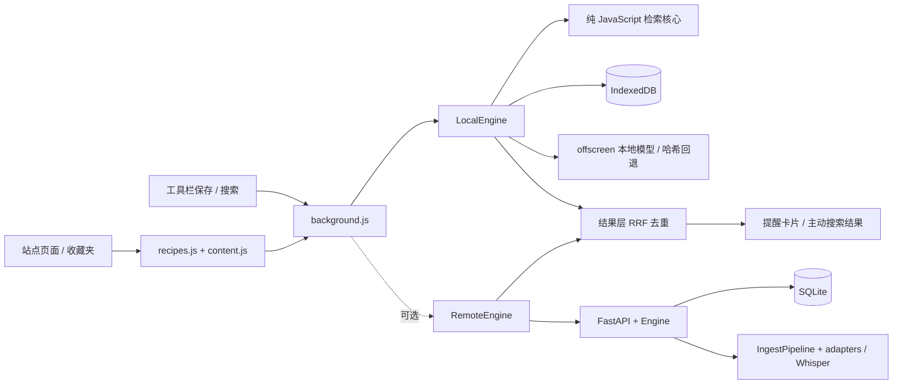

# 架构

## 产品边界与入口

ChekhovsGun 的目标是让已经收藏的知识在相关浏览场景中重新出现。自动提醒需要
足够大的收藏库和足够可靠的命中；主动搜索不受 15 条收藏门槛限制。

**浏览器扩展是默认运行入口。** 它独立完成页面采集、分块、索引和搜索，数据保存在
IndexedDB。Python 服务是可选的增强层，提供平台 API 同步、字幕／评论、Whisper
转写、链接正文抓取，以及 CLI 和仪表盘。两边保存各自的库，不做双向数据同步。



| 目录 / 文件 | 职责 |
| --- | --- |
| `extension/core/` | 无 DOM、Chrome API 或网络依赖的分词、分块、身份、BM25、向量与置信度 |
| `extension/platform/idb.js` | 条目、片段、向量、事件的持久化；修订号驱动内存索引失效 |
| `extension/engine/` | 异步编码、存储与检索装配，后端失败降级，以及结果融合 |
| `extension/background.js` | 消息路由、页面身份补全、提醒冷却、配置和模型重建调度 |
| `extension/recipes.js` / `content.js` | 已登录页面的 DOM 抽取、收藏按钮、收藏夹扫描、提醒卡片 |
| `extension/popup.*` / `options.*` | 手动采集、主动搜索、状态解释和设置 |
| `extension/offscreen.*` | 持有浏览器内语义模型，避免 service worker 重启时重复载入 |
| `chekhovsgun/` | 可选的 Python 服务、命令行、同步及检索实现（下表详述） |
| `scripts/` / `.github/workflows/` | 跨语言 fixtures、模型准备、打包和 CI / Release |

## 需要保持的不变量

- 页面上下文可以只有 URL 和站点名；进入缓存、冷却和检索前要补齐 `source_id`，
  否则同站不同页面会共用一个键，还会把当前页面推荐给自身。
- 身份归一化用于去重，打开原文使用采集到的可导航 URL；不能为了去重把 HTTP 页面改成 HTTPS。
- 两个引擎只融合结果，不能比较两边的向量。融合优先使用稳定条目 ID，缺失时才用 URL；
  视频 ID 和 URL 路径大小写必须保留。
- 每次编码结果携带实际编码器签名。并发模型失败、开关切换或批量重建不能把神经向量
  标成哈希向量。不同空间的片段仍参与 BM25，第一次失败的查询也必须可降级。
- 模型加载跨越异步操作，启动代次确保旧加载任务不会覆盖用户后来关闭模型的选择。
- 收藏夹扫描默认只保存链接和标题。后端启用时通过 `/api/capture/batch` 尝试转发并补正文；
  后端不可用时保留本地结果，当前没有持久化转发重试队列。
- `npm run build` 和 Release 共用打包脚本，只压缩过滤后的文件集合，每次生成全新的 ZIP。

## Python 模块

```
chekhovsgun/
├── models.py          SavedItem / Chunk / Hit / ItemHit / Context
├── config.py          环境变量 + config.toml + 默认值
├── http.py            带退避和限速的共享 HTTP 客户端
├── engine.py          门面：CLI 和服务端都只跟它打交道
├── ingest.py          适配器 → 字幕/评论 → 分块 → 向量 → 索引（增量）
├── sites.py           URL 归一化 + 站点识别（视频站以外的一切）
├── extract.py         从 HTML 里抽正文（收藏夹扫描和 URL 导入用）
├── transcribe.py      没有字幕时的本地 Whisper 兜底（挂在管线上，与来源无关）
├── tray.py            托盘常驻，免终端
├── cli.py             命令行
├── adapters/
│   ├── base.py        SourceAdapter 抽象：三个方法
│   ├── youtube.py     播放列表 + 字幕
│   ├── bilibili.py    收藏夹 + CC/AI 字幕
│   ├── wbi.py         B 站 WBI 签名
│   └── local.py       json/jsonl/csv/txt 导入
├── rag/
│   ├── text.py        中英混合分词、停用词、书写系统判定
│   ├── chunker.py     按字数 + 时长双约束切分，保留时间戳
│   ├── embeddings.py  local / openai / sentence-transformers
│   ├── store.py       SQLite + 内存向量矩阵 + BM25 倒排
│   └── retriever.py   混合检索、RRF 融合、置信度、按收藏聚合
├── llm/explain.py     可选的解读生成，默认降级为原文摘录
└── server/            FastAPI + 仪表盘
extension/             MV3 浏览器扩展
  recipes.js           站点规则表：加一个新站点只改这一个文件
packaging/             PyInstaller 入口与图标
```

## 几个设计选择

**为什么是 SQLite 而不是向量数据库。** 个人收藏夹是几千个片段的量级，
不是几百万。一个文件、零服务、随便备份；一个 float32 矩阵在内存里暴力算余弦，
十万片段也就几毫秒，远低于扩展需要的延迟。真到了需要 ANN 的规模再说。

**缓存靠 revision 计数器。** `Store` 每次写操作递增一个计数器，
向量矩阵和 BM25 统计在计数器变化时才重建。长时间跑的服务端不会反复读库。

**增量同步。** 每个条目算一个内容哈希（只包含会影响分块的字段）。
没变的条目跳过取字幕和算向量——取字幕是整个流程里最慢、最容易被限流的一步，
每晚同步两千条的库应该只动真正变了的那些。

**扩展通过 service worker 请求。** content script 直接请求 127.0.0.1 也可以
（浏览器把回环地址当作安全来源，不触发混合内容拦截），
但走 service worker 可以完全绕开页面自身的 CSP，
并且把缓存、防抖、设置集中在一个地方。

**UI 放在 shadow DOM 里。** YouTube 和 B 站都有很强的全局样式，
影子树是保证卡片在两边长得一样、且不污染页面的唯一可靠方式。

**采集是入库的另一半，不是第二套管线。** 适配器出去问平台要数据；采集接收用户
自己登录的浏览器已经看得到的东西——这是够到没有 API 的站点的唯一办法，也是不要求
用户交出密码就能读到登录后内容的唯一办法。两条路在 `IngestPipeline.ingest_one()`
汇合：它就是「收下一件收藏」的全部定义（判断有没有变、分块、向量化、落库）。
`run()` 取完 adapter 的内容后调它，`/api/capture` 内容本来就在手里所以直接调它。
下游因此完全不需要知道一条收藏是同步来的还是采集来的。

**DOM 规则与 URL 身份分离。** DOM 探针在 `extension/recipes.js`；URL 身份分别由
`extension/core/sites.js` 和 Python 的 `sites.py` / adapters 实现。
`scripts/gen_fixtures.py` 从 Python 生成身份、分块和打分样例，JavaScript 测试校验兼容性；
CI 重新生成并检查差异，避免端间 ID 漂移。

**内容哈希对帖子和视频不对称。** `content_hash()` 把正文算进帖子的哈希，
但不算进视频的。原因在于正文从哪来：视频的字幕是在哈希比对**之后**才去取的——
跳过这一步正是比对的全部意义——把字幕算进去就等于每次同步都要先下载一遍全部字幕
才能发现没事可做。帖子的正文跟标题在同一个请求里就到了，哈希它零成本，
而这正是「重新采集一篇改过的回答能正确更新」所依赖的。

**转写为什么不在 adapter 里。** 它只需要一个 URL 就能工作，所以放在管线上，
两个来源都自动拥有，以后加第三个来源时也是白送的。同理，它的开销是分钟级的，
所以闸门（单视频时长上限、每次同步的总预算）也在这一层，而不是散落在各个 adapter。

**用户列和平台列是分开的。** `status` / `user_tags` / `note` 由用户拥有，
`upsert_item` 的 ON CONFLICT 子句刻意不更新它们——否则每晚一次同步就会把用户
标记过「已学完」的东西全部复活。这条有测试钉着（`test_resync_preserves_the_users_own_columns`）。

**迁移只能加列，不能在基础 schema 里引用新列。** 老库上 `CREATE TABLE IF NOT EXISTS`
是空操作，如果基础 schema 里有一句 `CREATE INDEX ... ON items(status)`，
那么在老库上它会因为列不存在而直接失败——所有新增索引都必须放在 `_migrate()` 里。
这个坑有测试（`test_migrates_an_older_index_in_place`）。

## 检索链路

弹窗还有一道与打分无关的闸：库里不足 `min_library_items`（默认 15）条时一律不弹。
IDF 在只有几篇文档时没有意义，此时一个共享的常用词就足以让完全不相干的东西拿到
和真正命中一样的分数。这条闸只拦弹窗，不拦主动搜索。

```
查询文本
  ├─▶ 向量召回 (top 160)  ─┐
  └─▶ BM25 召回  (top 160) ─┴─▶ RRF 融合 ─▶ 片段类型加权
                                              │
                        每个收藏最多 N 个片段 ◀─┘
                                              │
                                   按收藏聚合 ─┴─▶ 置信度 = f(余弦, IDF 覆盖率)
                                                        │
                                         置信度门槛 + 相对分数门槛
                                                        │
                                          按 0.2·分数 + 0.8·置信度 排序
```

置信度和排序分数是两个不同的东西，理由见 README.md 的「检索是怎么做的」。
`tests/test_relevance.py` 把这条链路的行为钉成了黄金集回归。
